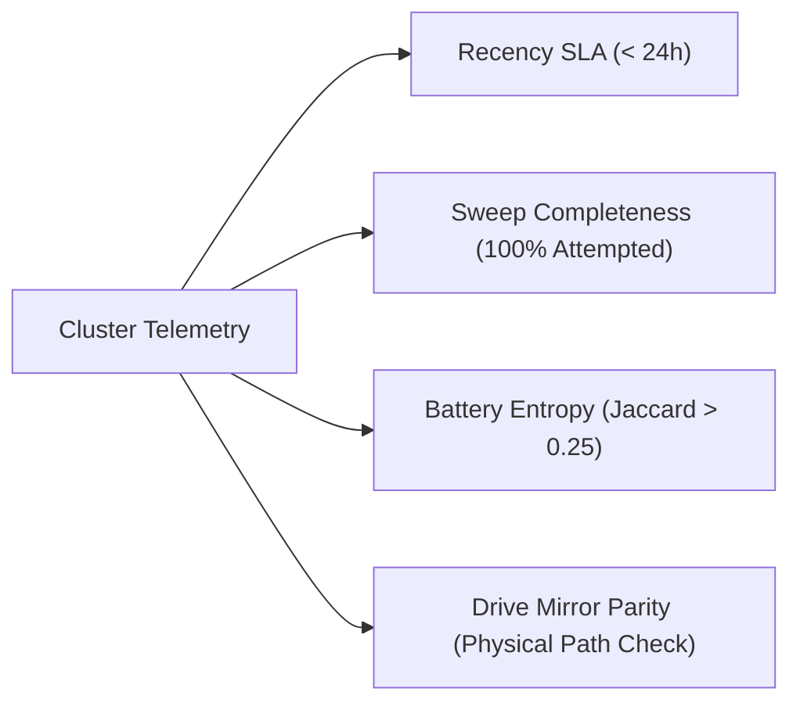

# NotebookLM Cluster Telemetry, Staleness Audit & Drive Mirror Specification

**Document Status:** Approved Architecture Standard  
**Date:** 2026-10-09  
**Target Repositories:** `TRM`, `kb-sync`, `trm-vault`  
**Execution Surfaces:** `trm mine-notebooklm`, `trm archive-chats`, `schedule-task-wrapper-TRM-Notebooklm-Mine.ps1`, `schedule-task-wrapper-TRM-Notebooklm-Chat-Archive.ps1`

---

## 1. Executive Summary

This specification establishes deterministic audit invariants, circuit-breaker logging, and filesystem parity controls for the 21 canonical NotebookLM partitioned notebooks and 3 operational buffers. It resolves the coverage collapse, silent sweep stalls, and boilerplate question loops discovered during the October 8, 2026 operational audit.

---

## 2. Authoritative Cluster Partitioning Matrix

All runners must operate over the full 21 canonical partitions plus 3 operational buffers (total: 24 primary targets):

| Category Key | Target Notebook UUID | Canonical Title | Operational Category |
|---|---|---|---|
| `willow-run` | `6fd7c40b-df90-444b-9c7a-a64682925856` | CIC - Willow Run & Aviation Engineering | `research` |
| `ford-politics` | `0caf6707-f8f2-4d2a-acd2-020acead55ba` | CIC - Ford Executive Dynamics & Politics | `research` |
| `post-war` | `9c469910-a900-43a4-877c-a43c9f545b5f` | CIC - Post-War | `research` |
| `willys-overland` | `fd4ebe29-9440-4f4b-97cf-0184ffbe29a0` | CIC - Willys-Overland | `research` |
| `cuba-claims` | `c8360946-dbee-4a2c-b622-7f89b05695b0` | CIC - Cuban Seizures & Retired Assets | `research` |
| `miami-estate` | `64949154-5892-4fa4-9ad0-e48b2bf5cc6c` | CIC - Miami Estate & Florida Retirement | `research` |
| `assembly-line` | `70be0df3-c58a-4711-b4d3-1e4b8726faf7` | CIC - Rouge, Model T & Moving Assembly Line | `research` |
| `master-kb` | `679b8bab-2d87-42cb-a726-6dc54c83acc2` | CIC-KB | `research` |
| `daily` | `1b4861a3-931f-4632-8fc1-343a8dd37df8` | CIC - Daily Research | `research` |
| `ironledger` | `76e1932c-054a-4520-9e83-5e882dffc938` | IronLedger Architecture | `operational` |
| `sigil` | `26eacb85-2c97-443d-9d81-3bd99cc98412` | Sigil Protocol & Federation | `operational` |
| `agent-harness` | `359b346c-6af7-4ba3-baef-b985c9e6e1af` | Agent Harnesses & Local Execution (Graft, SAM, Herdr) | `operational` |
| `rewrite-labs` | `140119ae-3496-45c9-bf0c-71c955136afc` | Rewrite Labs SSG/Redesign Platform | `operational` |
| `dev-triage` | `cb0498ce-1ea5-4668-9f65-ac368753404e` | Open Dev Issues (CI/CD Triage Buffer) | `operational` |
| `personal-os` | `9724e682-c5ea-4693-8e21-caf8de68611e` | Personal OS (Household, Utilities, Florida Logistics) | `operational` |
| `kb-governance` | `b42534be-a208-437e-828e-dad645631c66` | KB - Governance | `operational` |
| `kb-modules` | `096b5b92-55d0-44b2-b074-3b3fef0a0d12` | KB - Modules | `operational` |
| `kb-skills` | `3ac216cc-3379-4c9f-8393-ab28a248cecc` | KB - Skills | `operational` |
| `kb-operations` | `1ab8f1a2-f066-4246-8489-75f223d5f9d2` | KB - Operations | `operational` |
| `kb-meta` | `30f80cc0-80f7-421a-a79b-c510d98aaf94` | KB - Meta | `operational` |
| `kb-targets` | `0cab9d12-0f0e-4cc0-9009-69ec809fce4a` | KB - Targets | `operational` |
| `kb-superpowers` | `95867d03-1175-4516-9b38-d95592b1a321` | KB - Superpowers | `operational` |
| `grok-bot` | `52332bef-552c-427a-afb5-8cc48e6f0079` | Grok Bot Automation | `operational` |
| `ai-news` | `bec5a197-8256-4eba-af78-c4881cc28fdd` | AI News and Tools | `operational` |
| `toolforge-eco` | `39a71593-eb5b-4605-a4a4-f212ae010da2` | Toolforge Ecosystem | `operational` |

---

## 3. Four Core Audit Invariants



### 1. Recency SLA (< 24h Activity Invariant)
Every active notebook must register chat turns or an updated daily synthesis note within `< 24 hours`. Any notebook dormant for $> 24$ hours is flagged as `STALE_INJECTION_ALERT`.

### 2. Sweep Completeness Invariant
Sweep scripts must track `AttemptedCount` vs `TotalTargets`. If any child execution aborts before reaching 100% completion, the runner must exit code 1 and dispatch a critical alert via `send-critical-alert.ps1`.

### 3. Dynamic Question Battery & Entropy Invariant
- Static 4-question fallback loops are prohibited across consecutive runs.
- Runners must dynamically query `trm-research-gaps.md` for open gap items.
- The runner audits Jaccard battery entropy:
  $$\text{Entropy} = 1.0 - \frac{|Q_{\text{current}} \cap Q_{\text{previous}}|}{|Q_{\text{current}} \cup Q_{\text{previous}}|}$$
- If $\text{Entropy} < 0.25$ and previous questions exist, the system emits a `[BOILERPLATE-STAGNATION-ALERT]`.

### 4. Google Drive Mirror Parity Invariant
Every daily chat archival run (`chatArchiver.ts`) must mirror dated markdown synthesis notes directly to:
```
G:/My Drive/notebooklm/<slug>/Daily Synthesis Log - <YYYY-MM-DD>.md
```
Write errors are isolated and logged with `[DRIVE-MIRROR-ERROR]`.

---

## 4. Test Suite Coverage

The invariants are verified by automated tests in `C:\dev\trm`:
- [`tests/notebooklm/clusterCoverageAndParity.test.ts`](file:///C:/dev/trm/tests/notebooklm/clusterCoverageAndParity.test.ts): Asserts 100% cluster registration in `trm-vault`, operational typing, Drive folder existence, and 0% question battery overlap.
- [`tests/notebooklm/stalenessAndAuditTelemetry.test.ts`](file:///C:/dev/trm/tests/notebooklm/stalenessAndAuditTelemetry.test.ts): Tests recency violations, boilerplate loops, missing Drive mirrors, and coverage collapses.
- [`src/cli/commands/mineNotebooklm.test.ts`](file:///C:/dev/trm/src/cli/commands/mineNotebooklm.test.ts): Unit tests `computeBatteryEntropy()` and `loadDynamicGapQuestions()`.
- [`src/notebooklm/chatArchiver.test.ts`](file:///C:/dev/trm/src/notebooklm/chatArchiver.test.ts): Asserts Google Drive synthesis log mirroring.
