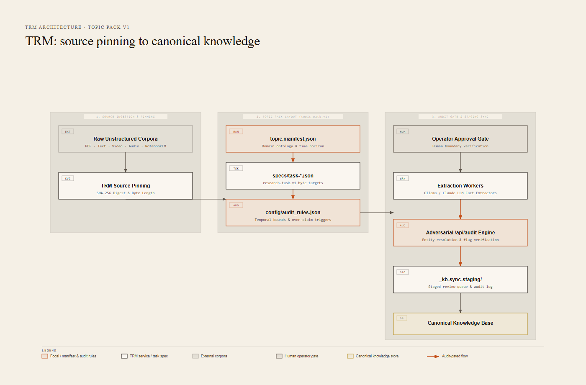

<!--
title: "Architecture & Data Model"
status: active
owner: chris
last-reviewed: 2026-09-26
brand: cic
-->

# Architecture & Data Model

The **Topic Research Module (TRM)** manages a tree of research topics structured as hierarchical directories on the local filesystem. This document details the on-disk format, directory topology, and lineage tracking invariants.

---

## 1. Topic Hierarchy & Node Typology

Topic paths are slash-separated filesystem routes (for example, `charlie/cuba` or `ww2/aviation/bombers/willow-run`). The depth of the directory path determines the node's architectural tier:

| Path Depth | Node Type | Purpose | Example |
| :--- | :--- | :--- | :--- |
| `1` | `project` | Top-level organizational root / research initiative | `charlie` |
| `2` | `topic` | Primary subject matter domain | `charlie/cuba` |
| `3+` | `subtopic` | Specialized domain investigation or leaf research focus | `charlie/cuba/havana-contacts` |

---

## 2. Standardized TRM Topic Pack Structure (`topic.pack.v1`)

Every initialized research topic in the TRM system implements the `topic.pack.v1` directory layout:

```text
topics/{topic_slug}/
├── topic.manifest.json         # Topic metadata, domain ontology, and scope bounds
├── corpus/                     # Raw source files pinned with sha256 digests
│   ├── source_catalog.json     # Registry of source IDs, hashes, and byte lengths
│   └── <source_id>.txt
├── specs/                      # Auto-generated research.task.v1 task files
│   ├── task-{topic_slug}-001.json
│   └── task-{topic_slug}-002.json
├── config/
│   └── audit_rules.json        # Topic-specific temporal bounds & over-claim triggers
├── _kb-sync-staging/           # Isolated staging queues and audit trails
│   ├── canonical_knowledge.json
│   ├── staged_review_queue.json
│   └── pipeline_audit_log.json
└── run_topic_pipeline.py       # Deterministic topic orchestrator
```

### Automated Scaffolding & Execution Pipeline

```mermaid
flowchart LR
    classDef inputStyle fill:#FAF6F0,stroke:#1A1410,stroke-width:2px,color:#1A1410;
    classDef stageStyle fill:#FAF6F0,stroke:#B8922A,stroke-width:2px,color:#1A1410;
    classDef gateStyle fill:#FAF6F0,stroke:#C4501A,stroke-width:2px,color:#1A1410;
    classDef syncStyle fill:#F5F0E6,stroke:#1A1410,stroke-width:2px,color:#5C5349;

    PIN["1. Source Pinning<br/>(SHA-256 Hashes)"]:::inputStyle --> DEC["2. Task Decomposition<br/>(research.task.v1)"]:::stageStyle
    DEC --> AUD_SYN["3. Audit Synthesis<br/>(Temporal & Entity)"]:::stageStyle
    AUD_SYN --> PROV["4. Pack Provisioning<br/>(topic.pack.v1 Layout)"]:::stageStyle
    PROV --> GATE["5. Operator Gate<br/>(Human Approval)"]:::gateStyle
    GATE --> EXEC["6. Extraction & Audit<br/>(Ollama / /api/audit)"]:::syncStyle
```



<details>
<summary>Mermaid source (kept for editing — the image above is what renders on the wiki)</summary>



</details>

---

## 3. Node Metadata Specification (`topic.json`)

```json
{
  "version": "1.0.0",
  "name": "cuba",
  "path": "charlie/cuba",
  "node_type": "topic",
  "status": "active",
  "description": "Historical analysis of Cast Iron Charlie operations in Cuba.",
  "actors": ["soren", "agent-codex"],
  "tags": ["cast-iron-charlie", "caribbean", "maritime"],
  "created_at": "2026-08-15T10:00:00.000Z",
  "updated_at": "2026-08-20T16:30:00.000Z"
}
```

---

## 4. Append-Only Lineage Ledger (`lineage/lineage.json`)

To guarantee strict reproducibility and auditability, every mutating operation writes an atomic record to `lineage/lineage.json`.

Supported operation types:
- `CREATE` — Node creation and directory initialization
- `INGEST` — New source ingested and assigned an incremental `SRC-NNN` ID
- `EXTRACT` — Fact extraction run against raw sources
- `SCORE` — Evaluation scoring and ancestor score rollup
- `CROSSLINK` — Graph edge recorded to a related topic
- `VERSION_BUMP` — Explicit semver version bump

Example lineage entry:
```json
[
  {
    "op_id": "op_01J5XYZ789ABCDEF",
    "operation": "INGEST",
    "actor": "soren",
    "timestamp": "2026-08-20T16:30:00.000Z",
    "details": {
      "source_id": "SRC-001",
      "title": "Willys Research Log",
      "origin": "notebooklm",
      "hash": "e3b0c44298fc1c149afbf4c8996fb92427ae41e4649b934ca495991b7852b855"
    }
  }
]
```

---

## 5. Scoring & Rollup Mechanics

Topics can be scored programmatically using scoring adapters. Scores evaluate:
1. **Source density**: Volume and diversity of ingested primary sources.
2. **Fact extraction coverage**: Density of structured claims extracted from text.
3. **Crosslink centrality**: Degree of graph interconnection with related topics.

When `trm score --rollup` is invoked, leaf subtopic scores propagate upward to parent topics and the root project container, providing an aggregated health metric for the entire research initiative.
