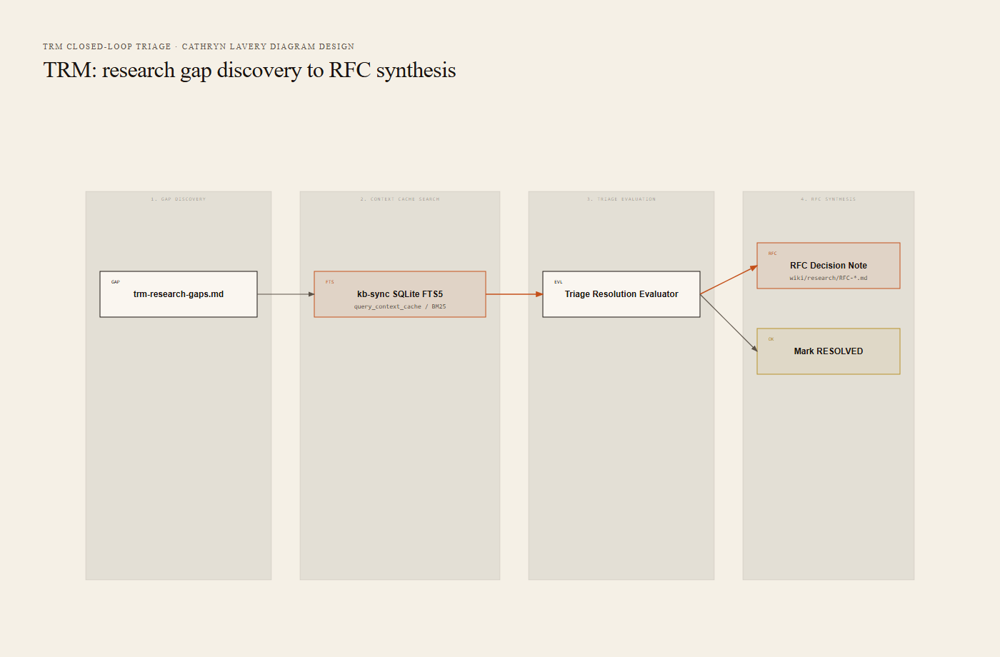
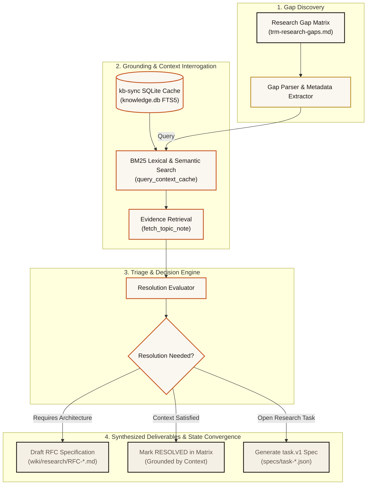

<!--
title: "Closed-Loop Gap Triage & RFC Synthesis"
status: active
owner: chris
last-reviewed: 2026-09-26
brand: cic
-->

# Closed-Loop Gap Triage & RFC Synthesis

**Type:** Workflow & Governance Pattern  
**Domain:** trm | kb-sync | wiki  
**Status:** Active  
**Last Updated:** 2026-08-23 via Log entry [[SemanticUpdateDate]]

---

## Definition

The Closed-Loop Gap Triage & RFC Synthesis workflow is TRM's automated mechanism for converting raw research gaps into grounded RFC decision notes and validated wiki specifications. It queries local SQLite context caches (`kb_fts`, BM25) to cross-reference evidence before promoting unresolved questions to formal architectural proposals.

---

## Why It Matters

Unstructured research notes frequently accumulate ambiguous claims and unverified assumptions. By enforcing an automated triage loop against the `kb-sync` knowledge base, TRM prevents duplicate research, grounds architectural decisions in cryptographic source evidence, and maintains a strict audit trail from gap discovery to production implementation.

---

## Architecture & Flow Diagram



<details>
<summary>Mermaid source (kept for editing — the image above is what renders on the wiki)</summary>



</details>

---

## The TRM Triage Loop

Executing the closed-loop triage agent follows five deterministic steps:

1. **Gap Parsing**: Reads pending research items in `trm-research-gaps.md` and extracts metadata (ID, domain, statement, and severity).
2. **Context Cache Interrogation**: Dispatches high-precision lexical queries to `kb-sync` via `query_context_cache` and `fetch_topic_note`.
3. **Cross-Reference Grounding**: Validates extracted assertions against verified wiki concepts and technical specifications.
4. **RFC Drafting**: For gaps requiring structural changes, drafts a standardized RFC decision note in `wiki/research/RFC-YYYY-MM-DD-<slug>.md`.
5. **State Convergence**: Updates gap matrix statuses from `OPEN` to `TRIAGED`, `RESOLVED`, or `RFC_DRAFTED`.

---

## RFC Specification Format

Synthesized RFC documents implement the canonical CIC decision note template:

```markdown
# RFC: [System / Research Component Name]

- **Status**: Draft | Under Review | Accepted
- **Author**: Antigravity TRM Triage Agent
- **Grounded References**: [[kb-sync/caching-strategy]], [[concepts/idempotency]]

## 1. Problem Statement & Research Gap
Summary of the unresolved technical or factual ambiguity.

## 2. Grounded Findings & Evidence
Citations from local SQLite knowledge cache and primary source extractions.

## 3. Proposed Resolution & Architecture Decision
Definitive decision and interface contracts.

## 4. Open Questions & Action Items
Immediate next steps for engineering and validation.
```

---

## Cross-References

- See [[Architecture & Data Model]] for the `topic.pack.v1` storage topology
- See [[CLI Reference & Commands]] for command signatures (`trm mine-notebooklm`)
- See [[Security Guardrails & Root Safety]] for zero-trust vault protection
