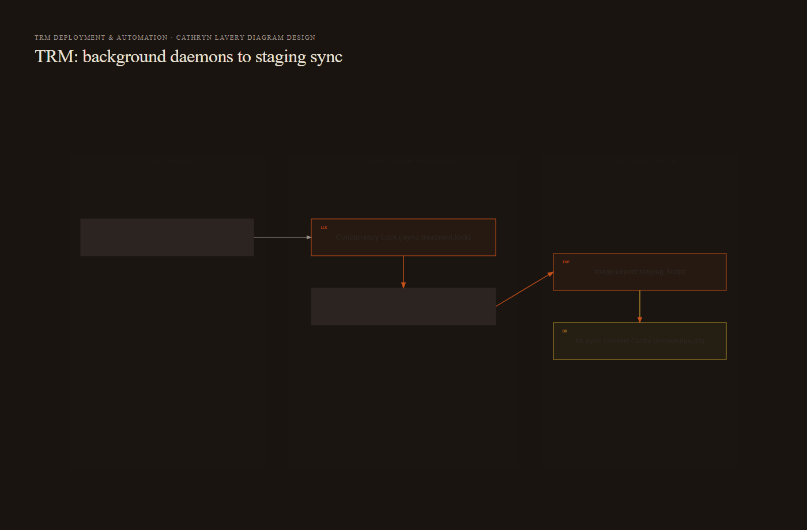
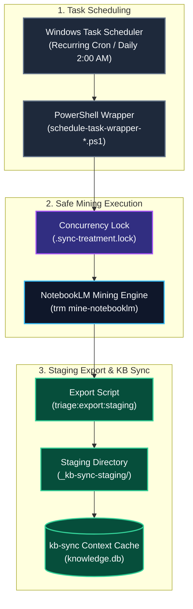

# Deployment & Automation

**Type:** Workflow & Operations Guide  
**Domain:** trm | deployment | automation  
**Status:** Active  
**Last Updated:** 2026-08-23 via Log entry [[SemanticUpdateDate]]

---

## Definition

The TRM Deployment & Automation subsystem manages background task execution, daemon scheduling, and staging export synchronization. It provisions recurring Windows Task Scheduler tasks and handles zero-collision mining passes across local topic packs (`topic.pack.v1`).

---

## Why It Matters

Manual research mining and extraction quickly introduce operational bottlenecks. By automating background mining daemons and export pipelines, TRM ensures continuous gap discovery, automated staging into `_kb-sync-staging/`, and systematic synchronization with canonical knowledge bases without manual operator intervention.

---

## Architecture & Flow Diagram



<details>
<summary>Mermaid source (kept for editing — the image above is what renders on the wiki)</summary>



</details>

---

## Windows Task Scheduler Registration

TRM includes `schedule-task-wrapper-TRM-Notebooklm-Mine.ps1` for background execution. Register the mining daemon with PowerShell:

```powershell
$action = New-ScheduledTaskAction -Execute "PowerShell.exe" `
  -Argument "-ExecutionPolicy Bypass -File C:\dev\trm\schedule-task-wrapper-TRM-Notebooklm-Mine.ps1"

$trigger = New-ScheduledTaskTrigger -Daily -At 2am

Register-ScheduledTask -TaskName "TRM-NotebookLM-Mining-Daemon" `
  -Action $action `
  -Trigger $trigger `
  -Description "Automated nightly TRM NotebookLM gap mining and triage"
```

---

## Staging Export Pipeline (`triage:export:staging`)

Export mined facts and research extractions into the `kb-sync` staging area:

```bash
npm run triage:export:staging
```

1. Reads verified extractions under `topics/{topic_slug}/_kb-sync-staging/`.
2. Formats structured research notes with canonical YAML frontmatter.
3. Transports staged records into `kb-sync` for SQLite FTS5 index update.

---

## Cross-References

- See [[Architecture & Data Model]] for `topic.pack.v1` staging layout
- See [[CLI Reference & Commands]] for CLI argument options
- See [[Closed Loop Gap Triage & RFC Synthesis]] for RFC drafting integration
