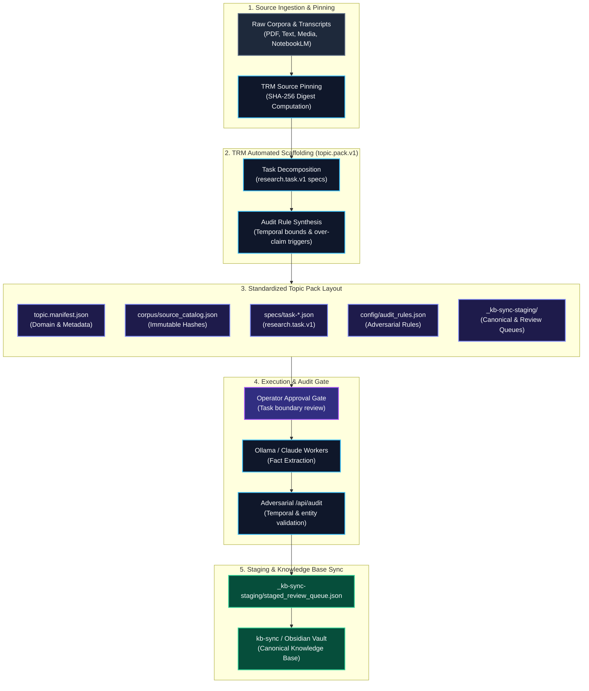

# Topic Research Module (TRM) Wiki

Welcome to the canonical engineering and operational documentation for the **Topic Research Module (TRM)**.

TRM is an enterprise-grade CLI and autonomous ingestion system for building hierarchical, lineage-tracked research topic trees on the local filesystem. It powers source ingestion, multimodal media processing, fact extraction, topic scoring/promotion, cross-linking, and closed-loop research gap triage across the federated Cast Iron Charlie (CIC) knowledge ecosystem.

---

## 🧭 Navigation & Knowledge Base Index

### 📐 Architecture & Core Principles
* [[Architecture & Data Model]] — Topic tree hierarchy, node directory contracts (`topic.json`, `sources/`, `extracts/`, `lineage/`), append-only operation logs, and scoring mechanics.
* [[Security Guardrails & Root Safety]] — `assertSafeRoot` zero-trust protection preventing research data leakage to public git remotes.

### 🛠️ Operations & CLI Guides
* [[CLI Reference & Commands]] — Complete reference for `trm create`, `ingest`, `extract`, `score`, `crosslink`, `version-bump`, and `validate`.
* [[Multimodal Ingestion & Media Pipeline]] — Image OCR/Vision analysis, ffmpeg video frame extraction, and whisper.cpp local audio transcription.
* [[NotebookLM & Mining Pipeline]] — Autonomous NotebookLM ingestion, question mining, and automated research gap extraction.

### 🔄 Integrations & Closed-Loop Governance
* [[Closed-Loop Gap Triage & RFC Synthesis]] — SQLite context cache integration (`kb_fts`, BM25), automated triage engine, and RFC synthesis.
* [[Deployment & Automation]] — Scheduled tasks, Windows Task Scheduler wrappers, environment configuration, and staging exports.

---

## ⚡ Quick Architecture Overview

Mermaid source (kept for editing — the image above is what renders on the wiki)

---

## 🔒 The Core Security Guarantee

Research artifacts (raw audio, transcribed video, internal source PDFs, proprietary notes) must never risk being committed or pushed to a public remote repository. 

Every TRM command enforces an immutable `assertSafeRoot` guardrail:
1. TRM traverses upward from the working directory to locate `.git`.
2. If a `.git` configuration contains a remote (`[remote "..."]`), execution terminates immediately with non-zero exit code.
3. Research data remains strictly contained in local vaults or non-remote repositories.
