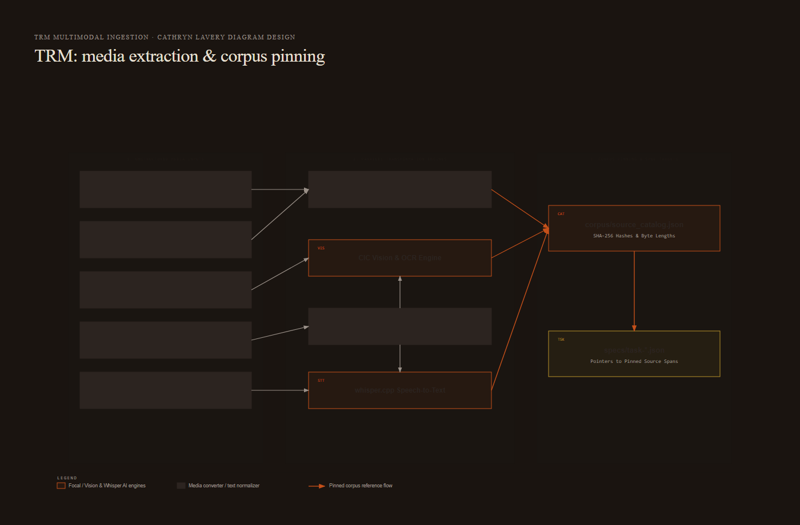
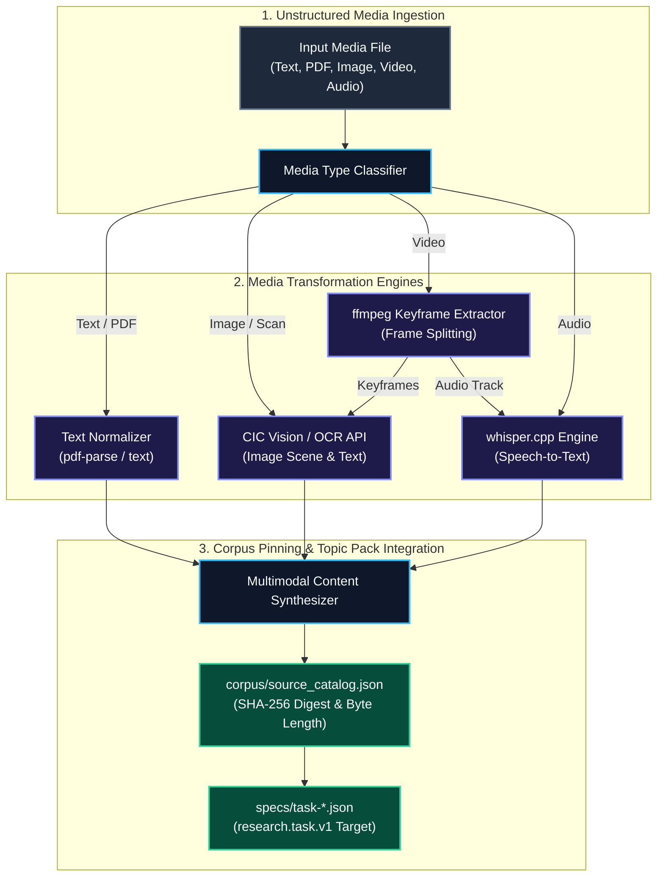

# Multimodal Ingestion & Media Pipeline

**Type:** Architecture & Operations Guide  
**Domain:** trm | ingestion | vision | whisper  
**Status:** Active  
**Last Updated:** 2026-08-23 via Log entry [[SemanticUpdateDate]]

---

## Definition

The Multimodal Ingestion & Media Pipeline handles parallel ingestion, OCR scanning, vision scene analysis, video keyframe extraction, and local speech-to-text transcription. It transforms unstructured media into pinned source text artifacts (`corpus/<source_id>.txt`) locked with SHA-256 digests.

---

## Why It Matters

Primary historical and operational evidence spans diverse media formats beyond raw text, including declassified PDFs, scanned factory layouts, historical video footage, and audio interviews. Standardizing these formats into cryptographic source targets enables unified entity extraction and rigorous audit rule checking across topic packs (`topic.pack.v1`).

---

## Architecture & Flow Diagram



<details>
<summary>Mermaid source (kept for editing — the image above is what renders on the wiki)</summary>



</details>

---

## Supported Media Formats

| Media Category | File Extensions | Processing Pipeline | Engine / Dependencies |
| :--- | :--- | :--- | :--- |
| **Text Documents** | `.txt`, `.md`, `.json`, `.csv` | Direct ingestion + SHA-256 hash | Built-in Node.js runtime |
| **PDF Documents** | `.pdf` | Text extraction + layout normalization | `pdf-parse` / Local parser |
| **Images & Scans** | `.jpg`, `.jpeg`, `.png`, `.webp`, `.tiff` | OCR + Visual scene analysis | CIC Vision Service (`CIC_INGESTION_URL`) |
| **Video Recordings** | `.mp4`, `.mov`, `.avi`, `.mkv` | Keyframe extraction + Vision analysis | `ffmpeg`, `ffprobe`, CIC Vision |
| **Audio Tracks** | `.mp3`, `.wav`, `.m4a`, `.ogg`, `.flac` | Speech-to-text transcription | `whisper.cpp` (`TRM_WHISPER_BIN`) |

---

## Concurrency & Hardware Tuning

Tuning environment variables optimizes GPU/CPU allocation during batch ingestion:

| Environment Variable | Default | Recommended Setting | Description |
| :--- | :--- | :--- | :--- |
| `TRM_IO_CONCURRENCY` | `8` | `8 - 16` | Maximum concurrent files processed for hashing and classification. |
| `TRM_VISION_CONCURRENCY` | `4` | `2 - 8` | Cap on concurrent requests sent to the local/remote Vision API. |
| `TRM_FFMPEG_CONCURRENCY` | `2` | `2 - 4` | Max concurrent ffmpeg subprocesses for frame extraction. |
| `TRM_FRAME_ANALYSIS_CONCURRENCY` | `3` | `2 - 6` | Concurrent visual analysis calls per individual video file. |
| `TRM_WHISPER_CONCURRENCY` | `1` | `1` | Max concurrent whisper transcriptions (serialized to protect CPU/VRAM). |

---

## Binary Path Configuration

Set binary environment variables for video frame extraction and audio transcription:

```bash
# Path to ffmpeg and ffprobe executables
export TRM_FFMPEG_PATH="/usr/bin/ffmpeg"
export TRM_FFPROBE_PATH="/usr/bin/ffprobe"

# Path to whisper.cpp binary and ggml model file
export TRM_WHISPER_BIN="/usr/local/bin/whisper-cli"
export TRM_WHISPER_MODEL="$HOME/.cache/whisper/ggml-base.en.bin"
```

---

## Cross-References

- See [[Architecture & Data Model]] for source catalog pinning details
- See [[CLI Reference & Commands]] for `trm ingest-dir` syntax
- See [[Security Guardrails & Root Safety]] for zero-trust raw source protection
