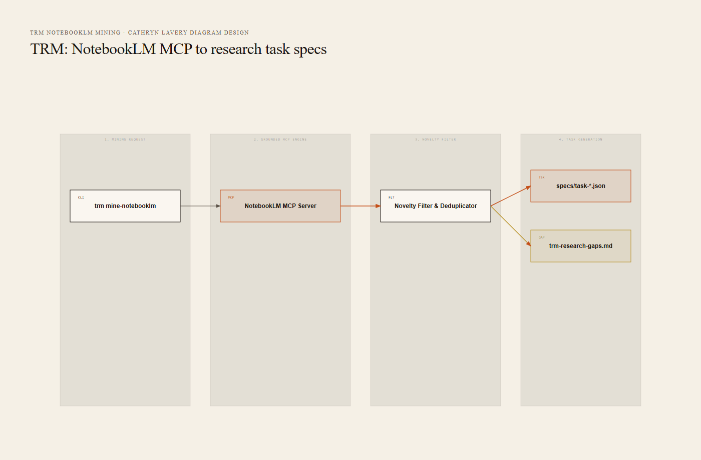
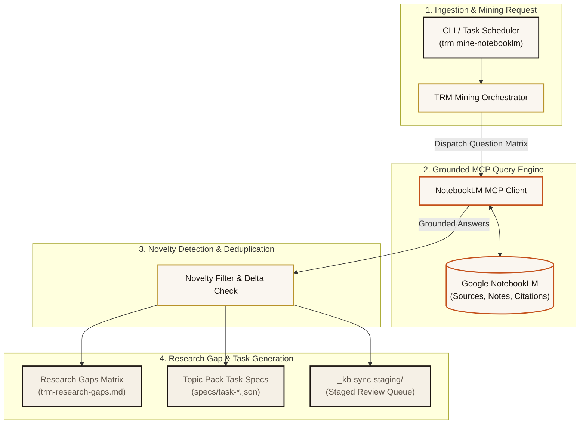

<!--
title: "NotebookLM & Mining Pipeline"
status: active
owner: chris
last-reviewed: 2026-09-26
brand: cic
-->

# NotebookLM & Mining Pipeline

**Type:** Architecture & Integration Guide  
**Domain:** trm | notebooklm | mining | triage  
**Status:** Active  
**Last Updated:** 2026-08-23 via Log entry [[SemanticUpdateDate]]

---

## Definition

The NotebookLM & Mining Pipeline integrates TRM with Google NotebookLM research notebooks. It automates the retrieval of curated notebook sources, note extraction, and continuous questioning to unearth unknown research gaps and feed the `topic.pack.v1` task generator.

---

## Why It Matters

Google NotebookLM provides deep grounded query capabilities across large document sets. Linking NotebookLM into TRM ensures that manual research insights automatically propagate into structured research task specifications (`research.task.v1`), establishing continuous feedback between high-level notebook analysis and atomic extraction workers.

---

## Architecture & Flow Diagram



<details>
<summary>Mermaid source (kept for editing — the image above is what renders on the wiki)</summary>



</details>

---

## Ingestion (`trm ingest-notebooklm`)

The `ingest-notebooklm` command retrieves sources, generated notes, and citations from a registered Google NotebookLM notebook:

```bash
trm ingest-notebooklm "018f4a56-789a-bcde-f012-3456789abcde" \
  --narrative-root ./vault/topics
```

Key capabilities:
- **Incremental Synchronization**: Only new or modified notebook documents are downloaded.
- **Citation Anchoring**: Retains direct links between synthesized notes and raw source spans.
- **Semantic Classification**: Automatically classifies and routes notebook sources to matching topic packs (`topic.pack.v1`).

---

## Question Mining (`trm mine-notebooklm`)

The `mine-notebooklm` command executes targeted research batteries against NotebookLM:

```bash
trm mine-notebooklm "018f4a56-789a-bcde-f012-3456789abcde" \
  --slug "cic-kb"
```

1. **Battery Execution**: Runs who, what, when, where, and why query matrices.
2. **Severity Tagging**: Classifies surfaced ambiguities into severity tiers (`CRITICAL`, `HIGH`, `MEDIUM`, `LOW`).
3. **Gap Matrix Append**: Writes new findings to `trm-research-gaps.md` for automated triage.

---

## Cross-References

- See [[Closed Loop Gap Triage & RFC Synthesis]] for triage loop processing
- See [[CLI Reference & Commands]] for `mine-notebooklm` syntax
- See [[Architecture & Data Model]] for `topic.pack.v1` task specs
