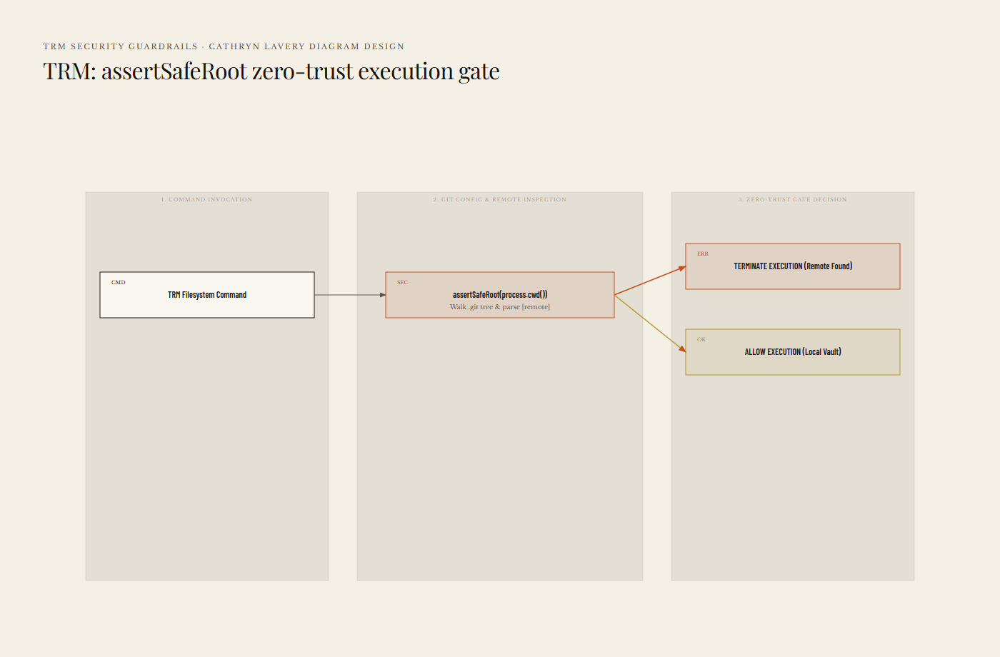
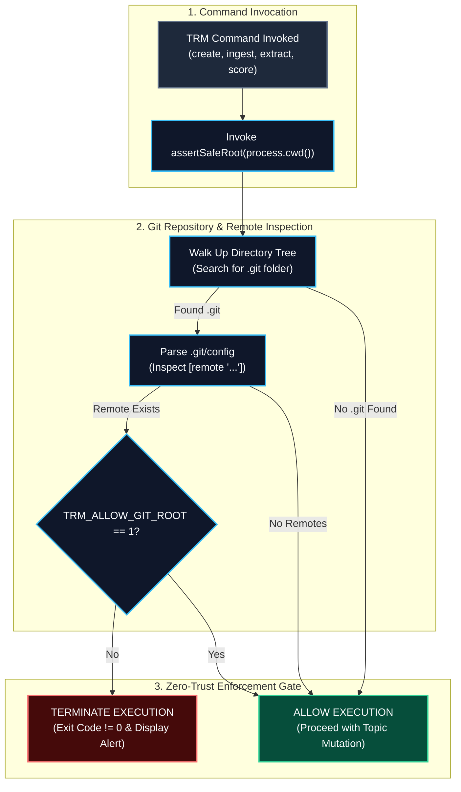

# Security Guardrails & Root Safety

**Type:** Governance Rule & Security Pattern  
**Domain:** trm | security | guardrails  
**Status:** Active  
**Last Updated:** 2026-08-23 via Log entry [[SemanticUpdateDate]]

---

## Definition

The `assertSafeRoot` guardrail is TRM's zero-trust security assertion engine located in `src/core/rootSafety.ts`. Before executing any filesystem mutation, TRM verifies that the current working directory does not reside inside a Git repository configured with remote push URLs, preventing accidental data leaks.

---

## Why It Matters

Research topic packs (`topic.pack.v1`) ingest raw primary sources, declassified field logs, and internal interview transcripts. Without root safety enforcement, a developer or automated script could inadvertently commit and push sensitive research data to a public or corporate Git remote via standard `git push`.

---

## Architecture & Flow Diagram



<details>
<summary>Mermaid source (kept for editing — the image above is what renders on the wiki)</summary>



</details>

---

## Supported Storage Configurations

| Storage Configuration | `assertSafeRoot` Result | Rationale |
| :--- | :--- | :--- |
| Standalone local directory (no `.git`) | **PASS** | No git repository present; zero leak risk. |
| Local-only Git vault (no remotes configured) | **PASS** | Local version control enabled without external push targets. |
| Repository with configured remote | **FAIL** | High leak risk. Data could be accidentally pushed via `git push`. |
| Repository with remote + `TRM_ALLOW_GIT_ROOT=1` | **PASS (Override)** | Explicit operator bypass. |

---

## Environment Override

Override root safety for public research repositories using environment variables:

```bash
export TRM_ALLOW_GIT_ROOT=1   # Linux / macOS
$env:TRM_ALLOW_GIT_ROOT="1"    # Windows PowerShell
```

> [!CAUTION]
> Enable `TRM_ALLOW_GIT_ROOT=1` only if no proprietary, classified, or copyrighted research assets reside in your topic tree.

---

## Cross-References

- See [[Architecture & Data Model]] for directory safety constraints
- See [[CLI Reference & Commands]] for command enforcement points
