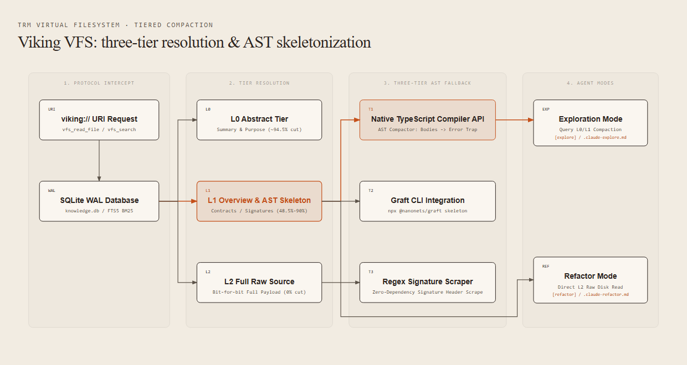
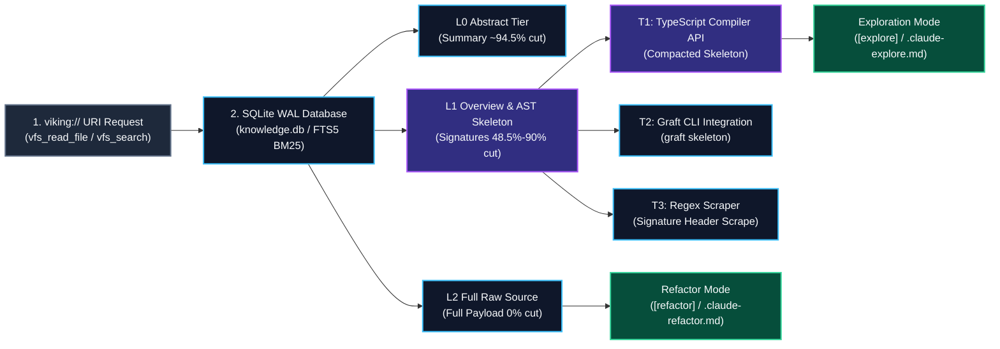

# Viking Virtual File System (VFS) & Tiered Compaction

The `viking://` virtual filesystem provider implements a high-speed SQLite Write-Ahead Logging (WAL) state machine and AST skeletonizer designed to reduce agent token overhead by up to 94.5% during codebase exploration and knowledge synthesis.

---

## Architecture Overview

Mermaid source (kept for editing — the image above is what renders on the wiki)

---

## Resolution Tiers

| Tier | Contents & Format | Ideal Usage | Token Impact |
| :--- | :--- | :--- | :--- |
| **`L0`** | Summary / Purpose / First-sentence concept abstract | Repository survey, topic listing, concept searching | **~94.5% reduction** |
| **`L1`** | AST Skeleton (interfaces, exported types, method contracts with bodies replaced by error traps) | Code comprehension, interface contracts, module boundary analysis | **~48.5% - 90% reduction** |
| **`L2`** | Raw file content (bit-for-bit full implementation) | Active refactoring, line-level editing, execution tests | **0% reduction (Full)** |

---

## Three-Tier AST Skeletonizer Fallback Engine

When resolving code files under `L1`, `viking-vfs-mount.mjs` applies a fail-soft three-tier fallback pipeline:

1. **Tier 1: Native TypeScript Compiler API**: Performs syntactic diagnostics, builds an AST, and transforms all function declarations, expressions, class methods, constructors, accessors, and arrow functions by replacing their bodies with a deterministic halt trap (`throw new Error("[COMPACTED SKELETON: IMPLEMENTATION STRIPPED - DO NOT EXECUTE]")`).
2. **Tier 2: Graft CLI Integration**: Triggers `graft skeleton <targetFile>` if TypeScript compiler API is unavailable.
3. **Tier 3: Regex Signature Scraper**: Zero-dependency fallback scanning classes, interfaces, types, and exported signatures.

---

## Operational Modes

| Mode | Trigger | Strategy |
| :--- | :--- | :--- |
| **Exploration Mode** | `[explore]` or `.claude-explore.md` | Use `viking://` `L0`/`L1` compaction. Avoid loading full `L2` details until edit targets are isolated. |
| **Refactor Mode** | `[refactor]` or `.claude-refactor.md` | Skip `L0`/`L1`. Load files directly at `L2`. Minimize roundtrips and preserve cache prefix stability. |
| **Direct Execution** | `npm test` / CLI commands | Run directly against raw disk files. |
